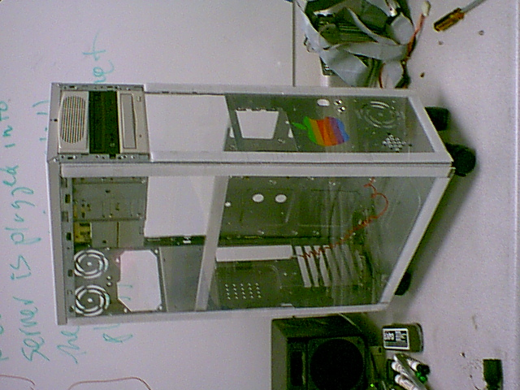
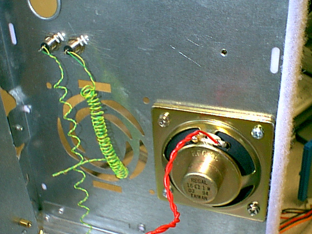

# Project 9500

https://www.reddit.com/r/retrobattlestations/comments/9n7mt0/9500_atx_hack_ca_2001/?utm_source=reddit&utm_medium=usertext&utm_name=VintageApple&utm_content=t1_jopwirg

I bought a retail copy of 10.0 when it hit the streets, and lucked into a Powermac 9500 MLB that could (technically) run it. Had no case for it, so I hacked it into an old ATX full tower that was on hand. Had to relocate the PSU to fit the logic board.

Stripped it down to a bare chassis and cut plexi to fit. Soldered up an adapter, rigged up some LEDs for power and direct-to-disk SCSI activity. Fun project - did it at work on overnight shifts.

Rocking a (puny) Twin Turbo 128 and Voodoo II, ROM hacked Adaptec SCSI card and 100MB ethernet.

This box ran OS 9, OS X 10.0 and Rhapsody DR2. You can't imagine how poor the experience of running 10.0 on that machine was.

----

